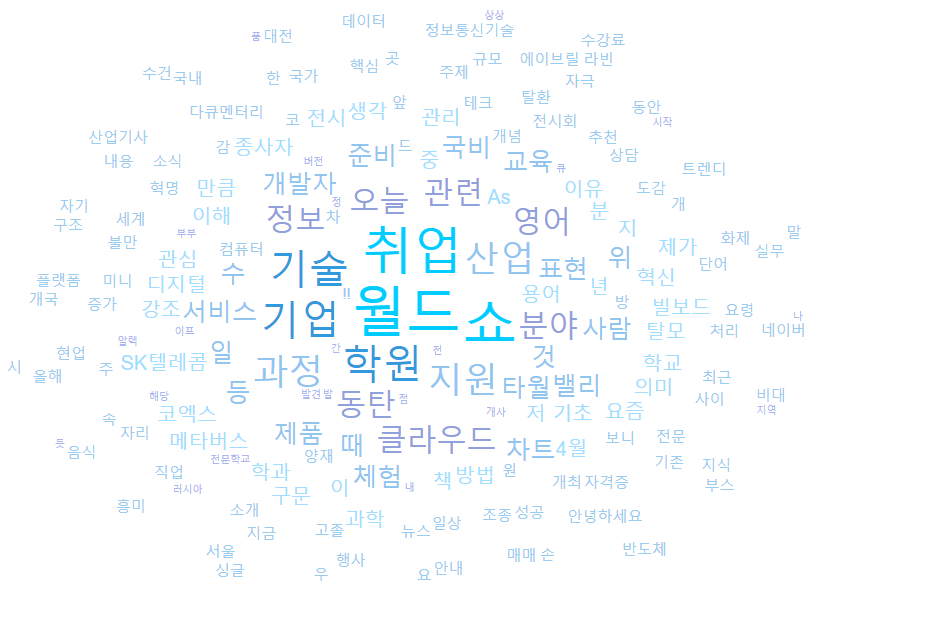

# DataPlay Project : 데이터 갖고 놀기
네이버 검색 API를 통한 을 통한 Word Cloud 만들기!

# **1. 명시 사항**
- 본 코드는 오직 json 데이터 나누고 정리하고, 분석하고, 최종적으로는 해당 단어들을 사용해 워드 클라우드를 만들어 보기 위해 작성하였습니다.
- 때문에 혹시라도 불법적인 사용에 이용하시는 경우 작성자의 의도와는 무관함을 알려드립니다.

# **2. 프로젝트 설명**
- 네이버 검색 API 는 네이버에서 제공하는 오픈 API 입니다. 해당 API 를 이용하면 직접 네이버에서 검색하지 않아도 다양한 데이터를 쉽게 검색하고 분석할 수 있습니다.
최종적으로는 검색된 데이터를 활용해서 웹에 word cloud 를 만들어 볼 예정입니다.
- 여기서 네이버 검색 API 는 네이버 전체를 검색하는 것이 아닌 블로그 검색 결과만을 출력하는 REST API 입니다.
- userDictionary 에 있는 koreanDic.user 파일은 komoran 을 이용해서 데이터 파싱 시 사용하는 사전입니다. 해당 사전에 있는 단어들은 형태로소 분석되지 않고
    즉 나눠지지않고 하나의 단어로 인식되어 분석됩니다.
  - 예를 들어 엘든링, PS5 같은 단어들은 엘든/링 PS/5 로 나눠서 분석되지만 사전안에 해당 단어가 있다면 '엘든링' 'ps5' 모두 하나의 단어로 인식됩니다.
- 업로드되지 않은 파일 중 interface APIdata 가 있습니다. 해당 인터페이스에는 naver api 를 사용하기 위한 api 사용 데이터가 있습니다.
    이 프로젝트를 다운받아서 사용하기는 경우 해당 interface 를 만든 후 아래 String 값을 만들어둔 후 NaverCrawler 에서 구현하여 사용하시기 바랍니다.
  - String naverID = "네이버 API ID";
  - String naverSecret = "네이버 API Secret";

# **3. 공부 목표 && 서비스 구현 목표**
- 네이버 검색 API 활용 : 네이버 검색 API 를 활용해서 내가 검색한 단어에 대한 데이터 가져와 보기 또한 이 과정에서 API 가 뭔지 이해하고 활용하기
- JSON 다루기 : JSON 자료형으로 웹에 전달하고 받으면서 json 공부하기
- JS / JQUERY : 프론트에서 JavaScript 와 JQuery 를 사용해서 웹을 다양하게 꾸며보기
- word cloud : 다양한 방식으로 word cloud 만들어보기 -> JQcloud && anychart 두가지 사용 예정
- spring 기능 다루기 : 웹에서 특정 단어에 대해서 검색이 들어올 시 Controller 를 사용해서 해당 정보를 검색, 파싱하여 다시 웹에 전달 
- ajax 다루기 : ajax 방식으로 데이터를 전달하고 받아서 활용해보기

# **4. 구현된 기능**
- 네이버 검색 api 를 사용해서 데이터 검색 -> 검색된 데이터를 parsing 하여 내가 원하는 데이터만 추출
- controller 를 사용하여 웹에서 들어온 요청에 해당하는 단어를 검색 메소드에 넣어서 데이터 추출 및 프론트에 전달
- 프론트에서는 ajax 방식으로 데이터를 받고, jquery 를 사용해 데이터를 정리 && 해당 페이지에 맞게 기능 꾸미기
- word cloud 를 만들어주는 api 를 활용해 워드 클라우드 구현

# **5. 추가 목표**
- D3.js 로 word cloud 구현 => 편하게 만들기 위해 anychart 를 사용했으나 d3.js 로 구현하면 더 이쁘게 나올 수 있을 듯함
- 워드 클라우드 뿐만 아니라 그래프 형식으로도 만들어서 2가지를 번갈아가면서 볼 수 있도록
- 프론트를 좀 더 이쁘게 css 까지 사용해서 꾸며보기

# **6. 아쉬운 점**

- 사실 가장 먼저 알아봤던 js 라이브러리는 wordCloud 였는데 도저히 어떻게 사용하지는 모르겠어서...포기하고 일단 편하고 빠르게 나오는 anychart 를 사용했다. 이 때문에 JS 를 공부가 꼭 필요하다는 것을 느꼈다.

- 다음으로 머신러닝에 관해서이다. 앞서 이야기한 userDictionary 의 경우 사용자가 필요한 단어를 일일히 넣어줘야하는 불편함이 있다. 특히나 최신 단어들, 고유 명사들에 대해서는 여기에 넣고 돌려야 정확한 결과가 도출된다. 사실 이 부분을 해결하고자 매일 특정 시간에 네이버 블로그를 검색하고, 해당 시간에 가장 많이 나왔던 단어를 알아서 userDirctionary 에 넣는 방법을 생각해보았으나...포기했다. 다만 이 부분은 로직만 조금 더 보완하면 할 수 있을 듯 하다.

  - 사실 사전에 단어를 넣는 가장 좋은 방법은 머신러닝을 통해서 알아서 익히고 추가하고 하는 방법일듯한데...이거야말로 나에게는 너무 먼 이야기고ㅠㅠ 내 역량이 조금만 더 뒷받침되었다면 훨씬 더 좋게 멋지게 만들 수 있었을텐데 얻어가는 것도 많았지만 아쉬운 점도 많았다.

# **7. 만들어본 예제**
- JQcloud

- AnyChart

# 활용한 API 목록
- 네이버 검색 api 주소 : https://developers.naver.com/main/
- 데이터 파싱을 위한 Java 기반의 형태소 분석기 : https://docs.komoran.kr/ 
- JQCloud : http://mistic100.github.io/jQCloud/index.html
- AnyChart : https://docs.anychart.com/Basic_Charts/Tag_Cloud
