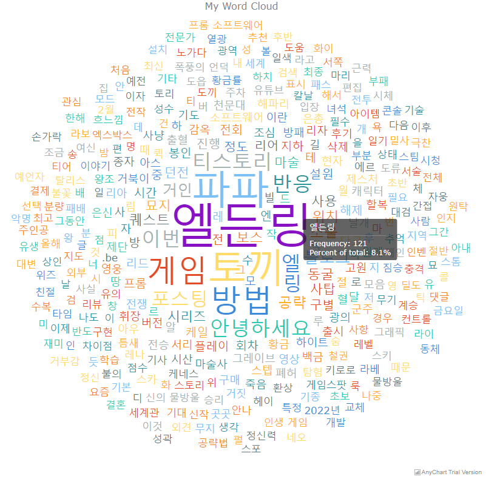

# DataPlay Project : 데이터 갖고 놀기
네이버 검색 API를 통한 을 통한 Word Cloud 만들기!

**1. 명시사항**
- 본 코드는 오직 json 데이터 나누고 정리하고, 분석하고, 최종적으로는 해당 단어들을 사용해 워드 클라우드를 만들어 보기 위해 작성하였습니다.
- 때문에 혹시라도 불법적인 사용에 이용하시는 경우 작성자의 의도와는 무관함을 알려드립니다.

**2. 작업 개요**
- 네이버 검색 API 는 네이버에서 제공하는 오픈 API 입니다. 해당 API 를 이용하면 직접 네이버에서 검색하지 않아도 다양한 데이터를 쉽게 검색하고 분석할 수 있습니다.
최종적으로는 검색된 데이터를 활용해서 웹에 word cloud 를 만들어 볼 예정입니다.
- 여기서 네이버 검색 API 는 네이버 전체를 검색하는 것이 아닌 블로그 검색 결과만을 출력하는 REST API 입니다.

**3. 공부 목표 && 서비스 구현 목표**
- 네이버 검색 API 활용 : 네이버 검색 API 를 활용해서 내가 검색한 단어에 대한 데이터 가져와 보기 또한 이 과정에서 API 가 뭔지 이해하고 활용하기
- JSON 다루기 : JSON 자료형으로 웹에 전달하고 받으면서 json 공부하기
- JS / JQUERY : 프론트에서 JavaScript 와 JQuery 를 사용해서 웹을 다양하게 꾸며보기
- word cloud : 다양한 방식으로 word cloud 만들어보기 -> JQcloud && anychart 두가지 사용 예정
- spring 기능 다루기 : 웹에서 특정 단어에 대해서 검색이 들어올 시 Controller 를 사용해서 해당 정보를 검색, 파싱하여 다시 웹에 전달 
- ajax 다루기 : ajax 방식으로 데이터를 전달하고 받아서 활용해보기

**4. 구현된 기능**
- 네이버 검색 api 를 사용해서 데이터 검색 -> 검색된 데이터를 parsing 하여 내가 원하는 데이터만 추출
- controller 를 사용하여 웹에서 들어온 요청에 해당하는 단어를 검색 메소드에 넣어서 데이터 추출 및 프론트에 전달
- 프론트에서는 ajax 방식으로 데이터를 받고, jquery 를 사용해 데이터를 정리 && 해당 페이지에 맞게 기능 꾸미기
- word cloud 를 만들어주는 api 를 활용해 워드 클라우드 구현

**5. 추가 목표**
- D3.js 로 word cloud 구현 => 편하게 만들기 위해 anychart 를 사용했으나 d3.js 로 구현하면 더 이쁘게 나올 수 있을 듯함
- 워드 클라우드 뿐만 아니라 그래프 형식으로도 만들어서 2가지를 번갈아가면서 볼 수 있도록
- 프론트를 좀 더 이쁘게 css 까지 사용해서 꾸며보기

**6. 만들어본 예제**
- JQcloud

- AnyChart

활용한 API 목록
- 네이버 검색 api 주소 : https://developers.naver.com/main/
- JQCloud : http://mistic100.github.io/jQCloud/index.html
- AnyChart : https://docs.anychart.com/Basic_Charts/Tag_Cloud